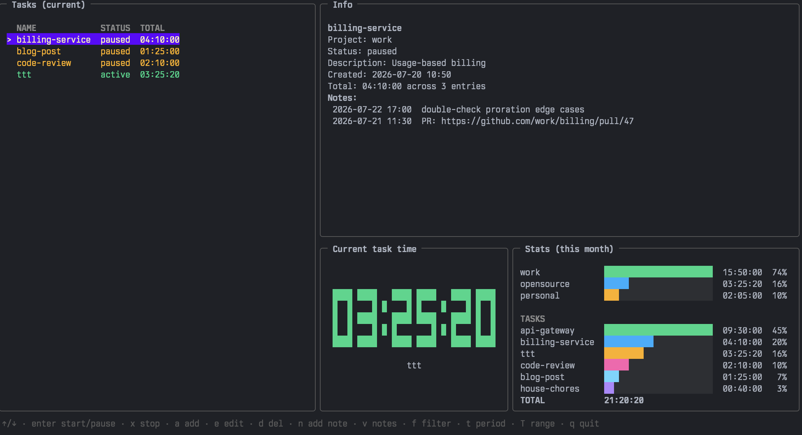

# ttt — Tasks & Time Tracker



A CLI-first task and time tracker with an interactive TUI.
Single binary, local [bbolt](https://github.com/etcd-io/bbolt) database.

- Tasks grouped by free-form **projects**, with a status lifecycle
  (`todo` → `active` → `paused` → `done`).
- Time entries per session; totals are the sum of sessions, so pause/resume is exact.
- **Notes** on tasks: PR links, context, anything.
- **Git integration**: link a repository to a task and your commits made during a tracking
  session are imported as notes automatically
- **Stats** per task and project over presets (today / week / month / custom
  `N`d/w/m/y) — in the TUI also via a from/to date-range picker.
- Full-screen **TUI** (`ttt tui`).

## Install

Build from source:

```sh
make build          # → dist/ttt
# or
go build -o ttt ./cmd/ttt
```

Release archives for Linux (amd64/arm64), macOS (arm64), and Windows
(amd64), plus deb/rpm/apk packages, can be downloaded from the releases page.

### Brew
```shell
brew install yousysadmin/apps/ttt
```

## Quick start

```sh
ttt add write-docs -p acme -d "API documentation"   # create a task
ttt start write-docs        # start tracking (auto-creates missing tasks)
ttt                         # → Tracking on write-docs for 00:12:34 (current session 00:02:10)
ttt pause                   # stop the clock, task stays resumable
ttt start write-docs        # resume — total time keeps accumulating
ttt note "https://github.com/acme/docs/pull/42"     # attach a note
ttt stop                    # finish: closes the session, marks task done
ttt list                    # tasks with status and totals
ttt stats -p 2w             # time per task/project, last two weeks
ttt show write-docs         # full task details incl. notes
ttt tui                     # interactive mode
```

## Commands

| Command | Description |
|---|---|
| `add <name>` | Create a task (`-d` description, `-p` project, `-g` git repo) |
| `start <name>` | Start tracking; pauses whatever else runs; auto-creates the task (`-p`, `-g` set fields) |
| `pause` | Close the running session; task stays resumable |
| `stop` | Close the running session and mark the task done |
| `list` | Tasks with project, status, total time (`-p` filters by project) |
| `note <text>` | Attach a note to the running task (`-t <task>` targets another) |
| `show <name>` | Task details: fields, dates, totals, notes |
| `edit <name>` | Update fields (`-n` rename, `-d`, `-p`, `-g`; empty value clears) |
| `stats` | Time per task and project (`-p/--period 10d/2w/6m/1y`, default `1m`; `--project` filters) |
| `tui` | Interactive terminal UI |
| `update` | Self-update to the latest GitHub release (`--check` only reports); blocked for brew/apk/deb/rpm installs — use the package manager instead |
| *(no command)* | Print tracking status |

Global flags: `--db <path>` (use a specific database), `--config <path>`,
`--json` (machine-readable output, see below), `--no-update-check` (disable the automatic update check), `--version`.

With `--json`, every command writes exactly one JSON document to stdout and
errors become `{"error": "..."}` on stderr (exit code 1), so output pipes
straight into `jq` and scripts. Durations appear both as seconds
(`total_seconds`, `session_seconds`) and as `HH:MM:SS` strings; timestamps
are RFC 3339.
Examples: `ttt --json list | jq '.[].task.name'`,`ttt --json stats | jq .total_seconds`.

After a successful command, ttt prints a one-line update notice to stderr
when a newer release exists (checked at most once a day, cached, terminal
only — pipes and scripts never see it). The TUI shows the same information
as a banner in its bottom bar.

## TUI

`ttt tui` opens a three-panel interface: task list (filterable), task info
with notes, a big seven-segment timer showing the running task's total, and
a stats panel with proportional bars.

| Key | Action |
|---|---|
| `↑/↓` `j/k` | Move between tasks |
| `enter` | Start the selected task / pause it when already running |
| `s` / `p` / `x` | Start / pause / stop explicitly |
| `a` | New task (form modal: name, description, project, repo) |
| `e` | Edit the selected task (same form; rename included) |
| `d` | Delete the selected task (confirmation modal) |
| `n` | Add a note to the selected task |
| `v` | Notes mode: `↑/↓` select, `e` edit, `d` delete, `esc` back |
| `f` | Cycle the list filter: current (active+paused) / new / done |
| `t` | Cycle the stats period: this month / today / this week |
| `T` | Custom stats range via from/to date pickers |
| `q` / `ctrl+c` | Quit |

## Git integration

Link a repository to a task with `-g/--git` on `add`, `start`, or `edit`
(the path is stored absolute). When a tracking session ends — `pause`,
`stop`, or being preempted by starting another task — commits from that
repository are imported as task notes:

- only commits whose commit time falls within the session window,
- only yours (filtered by the repo's `git config user.email`),
- deduplicated against already-imported ones,
- timestamped with the commit time, so they sort into the task's history.

Git failures (missing repo, no git) print a warning and never fail the
command.

## Configuration

Precedence: `--db` flag > `--config` file (must exist) > first config file
found > `TTT_*` environment variables > defaults.

Config files are searched as `{ttt,config}.{yaml,yml}` in `.`,
`$XDG_CONFIG_HOME/ttt` (`~/.config/ttt`), `~/.local/share/ttt`, `~/.ttt`.

```yaml
# ~/.config/ttt/config.yaml
database:
  path: /home/me/.local/share/ttt/ttt.db
```

Environment: `TTT_DATABASE_PATH`. Default database location:
`$XDG_DATA_HOME/ttt/ttt.db` (`~/.local/share/ttt/ttt.db`).

## Sync via cloud
By default, TTT stores the database in the path `~/.local/share/ttt/ttt.db`

You can change this path and set a path to a directory that is synced with your preferred cloud.

For ICloud, add to your `.zshrc`
```shell
export ICLOUD_PATH=~/Library/Mobile\ Documents/com\~apple\~CloudDocs
export TTT_DATABASE_PATH=$ICLOUD_PATH/ttt.db
```
